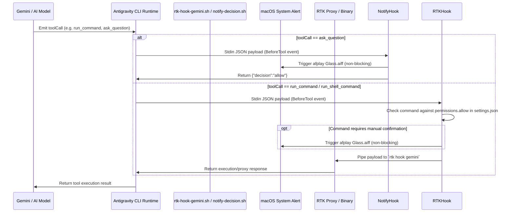
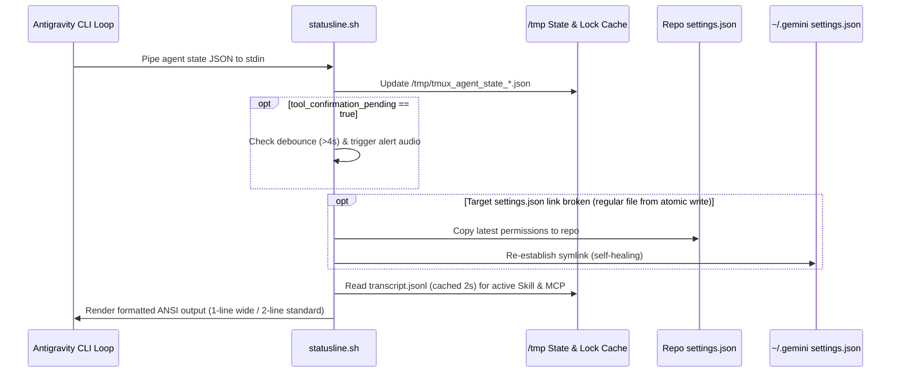

# Technical Architecture Documentation

## 1. System Overview & Component Diagram

Repository `.gemini` berfungsi sebagai lapisan orkestrasi, konfigurasi, tooling, dan ekstensi runtime untuk ekosistem Google Antigravity (CLI, IDE, dan Core runtime).

```mermaid
graph TD
    subgraph Antigravity Runtime
        CLI[Antigravity CLI / agy]
        Core[Antigravity Core Engine]
        IDE[Antigravity IDE]
    end

    subgraph Orchestration & Links
        Installer[install.sh]
        RepoConfig[Repo .gemini Configs]
        TargetDir[~/.gemini & ~/.agents]
    end

    subgraph Interception & Hooks
        BeforeToolHook[BeforeTool Hook]
        RTKHook[rtk-hook-gemini.sh]
        NotifyHook[notify-decision.sh]
        RTKProxy[RTK Token Killer]
        SystemAudio[macOS Audio / afplay]
    end

    subgraph UI & Monitoring
        Statusline[statusline.sh]
        TitleScript[title.sh]
        TmuxCache[/tmp/tmux_agent_state_*.json]
    end

    subgraph MCP Integrations
        MCPConfig[mcp_config.json]
        Context7[Context7 Docs]
        PodmanMCP[Podman MCP Server]
        K8sMCP[K8s MCP Server]
        MemoryMCP[Memory MCP / memory.jsonl]
    end

    subgraph Subagents & Roles
        DevOpsAgent[DevOps Engineer]
        CodeReviewerAgent[Code Reviewer - Java & Go]
    end

    Installer -->|ln -sf / ln -f| TargetDir
    RepoConfig --> Installer
    CLI --> Statusline
    CLI --> TitleScript
    Statusline --> TmuxCache
    TitleScript --> TmuxCache

    Core --> BeforeToolHook
    BeforeToolHook --> RTKHook
    BeforeToolHook --> NotifyHook
    RTKHook --> RTKProxy
    RTKHook --> SystemAudio
    NotifyHook --> SystemAudio

    Core --> MCPConfig
    MCPConfig --> Context7
    MCPConfig --> PodmanMCP
    MCPConfig --> K8sMCP
    MCPConfig --> MemoryMCP

    Core --> DevOpsAgent
    Core --> CodeReviewerAgent
    DevOpsAgent --> PodmanMCP
    DevOpsAgent --> K8sMCP
    CodeReviewerAgent --> Context7
```

---

## 2. Request & Execution Flow

### 2.1 Tool Call & Hook Interception Flow
Setiap pemanggilan tool oleh model AI dievaluasi oleh sistem hook sebelum dieksekusi:



### 2.2 Statusline & Self-Healing Loop


---

## 3. Concurrency & Resource Management
- **Non-Blocking Audio Alerts**: Seluruh panggilan audio (`afplay` dan `osascript`) dijalankan pada asynchronous subshell background `(...) & 2>/dev/null` sehingga loop rendering CLI tidak pernah mengalami block atau latensi.
- **I/O Debouncing & Cache**:
  - Peringatan audio dibatasi rate-limit minimal **4 detik** via `/tmp/antigravity_last_confirm_sound`.
  - Pembacaan log transkrip untuk deteksi aktif Skill/MCP dibatasi interval cache **2 detik** via `/tmp/antigravity_skill_mcp_*.ts`.
- **Atomic File Writes Mitigation**: Runtime CLI melakukan atomic file rename saat memperbarui `settings.json`. Arsitektur statusline mengimplementasikan *asynchronous self-healing watcher* untuk mendeteksi pemutusan link dan segera merestorasi tautan ke repositori.

---

## 4. Error Handling & Fault Tolerance
- **Pipe Fail Safety**: Semua shell script menggunakan `set -euo pipefail` atau `set -eo pipefail` dengan fallback pengaman `|| true` pada operasi opsional dan parsing string.
- **Safe JSON Fallbacks**: Parsing via `jq` selalu menyertakan fallback default `// empty` atau `// false` untuk mencegah error saat struktur metadata berubah.
- **Safe Cleaners**: Utilitas pembersihan percakapan ([`clean-conversations.sh`](file:///Users/i/work/KAnggara75/.gemini/skills/ka-del-conversation/clean-conversations.sh)) menyediakan mode dry-run (`-n`), filter umur (`-o DAYS`), dan seleksi berbasis target per-surface (`--cli`, `--ide`, `--core`).

---

## 5. Telemetry & Observability
- **Tmux State Sharing**: Status agent disimpan dalam format JSON di `/tmp/tmux_agent_state_global.json` dan `/tmp/tmux_agent_state_<pane_id>.json`, memungkinkan statusline tmux dan script eksternal mengakses status agent secara real-time.
- **Terminal Title Dynamic Sync**: Script [`antigravity-cli/title.sh`](file:///Users/i/work/KAnggara75/.gemini/antigravity-cli/title.sh) secara otomatis memformat status agent (emoji + status + nama project) pada tab terminal / jendela tmux.
